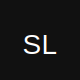

# SportLink - Social Platform for Athletes



**SportLink** is a dual-platform social networking application designed for athletes, clubs, agents, and sports professionals to connect, share, and collaborate.

## 🚀 Platform Overview

This project consists of **two separate applications** sharing the same backend:

- **🌐 Web App**: Next.js 14 with App Router (Tailwind CSS + DaisyUI)
- **📱 Mobile App**: Expo/React Native (iOS & Android)
- **🔌 Backend**: Shared Next.js API routes with JSON storage

## 📋 Quick Start

### Prerequisites

- Node.js 18+ 
- pnpm (recommended) or npm
- Expo Go app (for mobile development)

### Installation

```bash
# Clone repository
git clone https://github.com/simolima/sportlink-demo.git
cd sportlink-demo-template

# Install web dependencies
pnpm install

# Install mobile dependencies
cd mobile
pnpm install
cd ..
```

### Development

**Web Only**:
```bash
pnpm dev
# → Open http://localhost:3000
```

**Mobile + Web** (both servers required):
```bash
# Terminal 1 - Web Server (API)
pnpm dev

# Terminal 2 - Mobile App
pnpm dev:mobile
# → Scan QR code with Expo Go
```

## 🏗️ Architecture

### Project Structure

```
sportlink-demo-template/
├── app/                    # Next.js App Router (Web)
│   ├── api/               # API Routes (shared by web + mobile)
│   ├── home/              # Feed page
│   ├── profile/           # User profiles
│   └── ...
├── components/            # React components (Web only)
├── lib/                   # Utilities (Web)
│   ├── cors.ts           # CORS for mobile
│   └── types.ts          # TypeScript types
├── mobile/                # Expo Mobile App (ISOLATED)
│   ├── screens/          # Mobile screens
│   │   ├── FeedScreen.tsx
│   │   └── ProfileScreen.tsx
│   ├── lib/              # Mobile utilities
│   │   ├── api.ts        # API client
│   │   └── services.ts   # Business logic
│   ├── App.tsx           # Entry point
│   └── package.json      # Mobile dependencies (separate!)
├── data/                  # JSON Database (shared)
│   ├── users.json
│   ├── posts.json
│   └── ...
└── package.json           # Web dependencies
```

### Key Principle: Dependency Isolation

**No monorepo workspace** - Dependencies are completely isolated:
- Web: `package.json` (React 18)
- Mobile: `mobile/package.json` (React 19)
- Shared: API routes via HTTP

This prevents dependency conflicts and allows independent versioning.

## 🎨 Design System

**Color Theme**: Green (#16a34a)
- Primary: `green-600` (#16a34a)
- Hover: `green-700` (#15803d)
- Light: `green-50` (#f0fdf4)

**Styling**:
- Web: Tailwind CSS + DaisyUI
- Mobile: React Native StyleSheet with same color palette

## 🔌 API Architecture

All API routes in `app/api/` are **shared** between web and mobile:

```typescript
// Example: app/api/posts/route.ts
export const runtime = 'nodejs'
import { withCors } from '@/lib/cors'

export async function GET() {
    const posts = readPosts()
    return withCors(NextResponse.json(posts))  // CORS for mobile
}

export async function OPTIONS() {
    return withCors(new NextResponse(null, { status: 204 }))
}
```

**Endpoints**:
- `/api/users` - User management
- `/api/posts` - Feed posts
- `/api/likes` - Post likes
- `/api/comments` - Comments
- `/api/follows` - Follow relationships
- `/api/messages` - Direct messages

## 📱 Mobile Development

### Network Configuration

Mobile app connects to web server via local IP address.

**Configure in `mobile/lib/api.ts`**:
```typescript
const BASE_URL = 'http://192.168.1.37:3000'  // Use YOUR PC IP
```

**Find your IP** (Windows):
```powershell
ipconfig
# Look for "IPv4 Address" under your WiFi/Ethernet adapter
```

**Requirements**:
- PC and phone on same WiFi network
- Web server running (`pnpm dev`)
- Firewall allows port 3000

### Mobile Features

- ✅ Feed with banner header
- ✅ Create post composer
- ✅ User profiles with stats
- ✅ Pull-to-refresh
- ✅ Tab navigation (Feed/Profile)
- ✅ Logout functionality

## 🛠️ Available Scripts

### Web

```bash
pnpm dev          # Start dev server (port 3000)
pnpm build        # Build for production
pnpm start        # Start production server
pnpm lint         # Run ESLint
```

### Mobile

```bash
pnpm dev:mobile   # Start Expo (from root)
cd mobile         # Enter mobile directory
pnpm start        # Start Expo (alternative)
npx expo start -c # Clear cache and start
```

## 📚 Documentation

- **[MOBILE_DEV_GUIDE.md](MOBILE_DEV_GUIDE.md)** - Complete mobile setup guide for developers
- **[.github/copilot-instructions.md](.github/copilot-instructions.md)** - AI agent instructions and architecture details

## 🚀 Deployment

### Web (Vercel)

```bash
# Push to main branch - auto-deploys to Vercel
git push origin main
```

Vercel auto-detects Next.js and deploys automatically.

### Mobile (EAS Build)

```bash
cd mobile

# Install EAS CLI
npm install -g eas-cli

# Login to Expo
eas login

# Configure project
eas build:configure

# Build for Android
eas build --platform android

# Build for iOS (requires Apple Developer account)
eas build --platform ios

# Submit to stores
eas submit --platform all
```

## 🔐 Authentication (Demo)

**Current**: localStorage-based (demo only)
- No real authentication
- Email-based login without password
- Session stored in localStorage

**Future**: Migrate to Supabase Auth or NextAuth.js

## 💾 Data Storage

**Current**: JSON files in `data/` directory
- Simple file-based storage
- Shared between web and mobile via API
- Perfect for MVP/demo

**Future**: Migrate to Supabase PostgreSQL or similar

## 🧪 Testing

```bash
# Web
pnpm test

# Mobile
cd mobile
pnpm test
```

## 🤝 Contributing

### Team Workflow

1. Clone repository
2. Install dependencies (web + mobile)
3. Configure mobile IP in `mobile/lib/api.ts`
4. Create feature branch
5. Test both platforms
6. Submit PR

### Best Practices

✅ **DO**:
- Work on one platform at a time
- Install mobile packages from `mobile/` directory
- Test on real devices via Expo Go
- Use CORS wrapper in API routes

❌ **DON'T**:
- Create `pnpm-workspace.yaml` (causes conflicts)
- Install mobile packages from root
- Use `localhost` in mobile API calls
- Mix web/mobile dependencies

## 📦 Tech Stack

### Web
- Next.js 14.2.5
- React 18.3.1
- Tailwind CSS 3.4.1
- DaisyUI 4.12.14
- TypeScript

### Mobile
- Expo ~54.0.25
- React Native 0.78.6
- React 19.1.0
- TypeScript

### Backend
- Next.js API Routes
- Node.js filesystem (JSON)
- CORS middleware

## 🗺️ Roadmap

### Phase 1: MVP ✅
- [x] Web app with feed, profiles, messages
- [x] Mobile app with feed and profiles
- [x] Shared API backend
- [x] CORS-enabled endpoints

### Phase 2: Database Migration (In Progress)
- [ ] Supabase integration
- [ ] PostgreSQL database
- [ ] Real authentication
- [ ] File uploads to Supabase Storage

### Phase 3: Mobile Features
- [ ] Post creation from mobile
- [ ] Image upload (camera/gallery)
- [ ] Push notifications
- [ ] Offline support

### Phase 4: Production
- [ ] Input validation
- [ ] Rate limiting
- [ ] Error tracking (Sentry)
- [ ] Analytics
- [ ] Performance optimization

## 📄 License

MIT License - See LICENSE file for details

## 👥 Team

**SportLink Team** - Building the future of sports networking

## 🆘 Support

- 📖 Read [MOBILE_DEV_GUIDE.md](MOBILE_DEV_GUIDE.md) for setup help
- 🐛 Report issues on GitHub
- 💬 Contact team on Slack/Discord

---

**Built with ❤️ by SportLink Team** | November 2025
